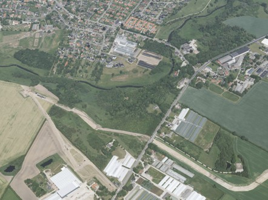
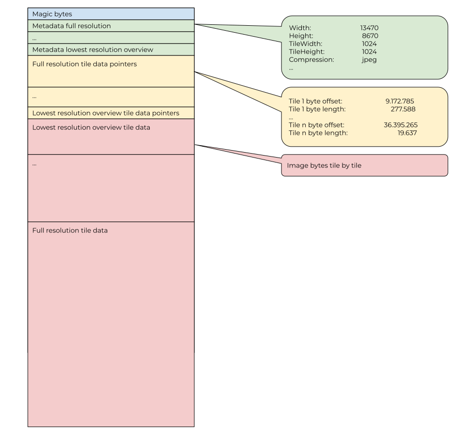

# cogtiler 🍸
`cogtiler` acts as a proxying tile server which exposes tiles from jpeg compressed Cloud Optimized GeoTIFFs using as few server resources as possible.

For tiles completely filled with image data `cogtiler` doesn't even decompress the jpeg but passes the fetched bytes untouched on to the client.

When the image dimensions are not a multiple of the tile size the client can decide what should happen with edge tiles. `cogtiler` has three ways of handling these "out of bounds" areas: `pad`, `crop` or `mask`.

`pad` pads the image with random data. This option requires the least amount of resources from the server and is therefore the fastest. All tiles will have the same dimensions.


`crop` crops the tiles that are not entirely filled by source image data. Edge tiles will have different dimensions from tiles completely covered by the source image.



`mask` masks the part of the tile which is outside the source image with black pixels. All tiles will have the same dimensions.


## Technical background
For background info on how a Cloud Optimized GeoTIFF works please see https://www.cogeo.org/in-depth.html.

At the beginning of the Cloud Optimized GeoTIFF it has a header which defines the internal organization of the file.  For each resolution (overviews and full) it defines tile dimensions, compression scheme, number of overviews and other things (green). Then for each resolution it has a list of offsets and lengths to each individual tile data chunk (yellow). And at last is has the actual compressed image data (red).

Using http range requests it is possbile to read random parts of the COG.

When `cogtiler` has to fetch a tile from a COG it first fetches the header (blue, green and yellow) and parses it. Now it knows the structure of the TIFF and using this information makes it possible to fetch the exact byte range which holds the requested tile.


As these bytes are already jpeg compressed, they can be returned as is to the client making this operation extremely fast using very few resources. 

The exception to this rule is when requesting edge tiles where the image dimensions are not a multiple of the tile size. Here `cogtiler` allows the client to choose what happens with the pixels which are not part of the source image (as described above). In this case some image manipulation may be necessary for some tiles. For these tiles `cogtiler` utilizes the [libjpeg-turbo](https://www.libjpeg-turbo.org/) library which should be as resource effective as possible.

### Caching
Usually a client reading tiles from a COG will read a numerous tiles at the same time. To reduce the number of header requests `cogtiler` caches the latests 1024 headers in a LRU cache (see [code](https://github.com/SDFIdk/skraafoto_tile_public/blob/cc2758d4ac540a551b4966fe4018241c58036bbd/src/cogtiler/cog.py#L74)).

## Acknowledgments

The part of cogtiler (`aiocogdumper`) which does the actual TIFF reading is heavily based on https://github.com/mapbox/COGDumper. Thank you Mapbox.

## Configuration

### Whitelist
`cogtiler` may be restricted to only proxy COGs from a fixed set of domains. This is done with a whitelist matching on prefix. The whitelist is configured
using the environment variable named `COGTILER_WHITELIST` and is an array of allowed URL prefixes encoded as a json array like:

```
COGTILER_WHITELIST=["https://api.dataforsyningen.dk/","https://septima.dk"]
```

Note: Depending on the context (where the env var is set) it may be necessary to escape the quotes.

When `cogtiler` recieves a request to read data from a COG at a certain url, it checks if the url starts with one of the prefixes from the whitelist. Otherwise an error is returned to the client.

### Request timeout
Environment variable `COGTILER_REQUEST_TIMEOUT` sets the timeout in seconds for http requests against the upstream server hosting the COG.

### Cache control
Environment variable `COGTILER_CACHE_MAX_AGE` sets the number of seconds a browser is allowed to cache responses from this API.

### Header bytes
`cogtiler` fetches a predefined number of bytes from the beginning af the file, if the header is bigger than this then more roundtrips are made. 

The number of bytes initially fetched are `16384` by default, but this can be overridden by using the environment variable `COG_INGESTED_BYTES_AT_OPEN` (see [code](https://github.com/Dataforsyningen/skraafoto_tile_public/blob/cc2758d4ac540a551b4966fe4018241c58036bbd/src/cogtiler/aiocogdumper/cog_tiles.py#L229)).

## Disclaimer
`cogtiler` is built for and tested with COGs that are jpeg compressed using GDAL. It will definitely NOT work with anything else than jpeg compression. It is most likely possible to create jpeg compressed COGs that wont work with `cogtiler`.

## Development

Using vscode install the [Docker](https://marketplace.visualstudio.com/items?itemName=ms-azuretools.vscode-docker) extension.

Then create

`.vscode/launch.json`:
```json
{
    // Use IntelliSense to learn about possible attributes.
    // Hover to view descriptions of existing attributes.
    // For more information, visit: https://go.microsoft.com/fwlink/?linkid=830387
    "version": "0.2.0",
    "configurations": [
        {
            "name": "Python: FastAPI",
            "type": "python",
            "request": "launch",
            "module": "uvicorn",
            "cwd": "${workspaceFolder}/src/cogtiler",
            "args": [
                "main:app"
            ],
            "jinja": true
        },
        {
            "name": "Docker: Python - Fastapi",
            "type": "docker",
            "request": "launch",
            "preLaunchTask": "docker-run: debug",
            "python": {
                "pathMappings": [
                    {
                        "localRoot": "${workspaceFolder}/src/cogtiler",
                        "remoteRoot": "/app"
                    }
                ],
                "projectType": "fastapi"
            }
        }
    ]
}
```

and `.vscode/tasks.json`
```json
{
	"version": "2.0.0",
	"tasks": [
		{
			"type": "docker-build",
			"label": "docker-build",
			"platform": "python",
			"dockerBuild": {
				"tag": "cogtiler:latest",
				"dockerfile": "${workspaceFolder}/Dockerfile",
				"context": "${workspaceFolder}",
				"target": "debug",
				"pull": true
			}
		},
		{
			"type": "docker-run",
			"label": "docker-run: debug",
			"dependsOn": [
				"docker-build"
			],
			"dockerRun": {
				"ports": [
					{
						"containerPort": 8000,
						"hostPort": 8000
					}
				]
			},
			"python": {
				"args": [
					"main:app",
					"--host",
					"0.0.0.0",
					"--port",
					"8000"
				],
				"module": "uvicorn"
			}
		}
	]
}
```

Now you should be able to hit "Start debugging" `Docker: Python - Fastapi` which will launch `cogtiler` in a docker cointainer supporting breakpoints in your code.

`test_requests.http` has a bunch of test requests you can use to test the api. You have to install the [REST Client](https://marketplace.visualstudio.com/items?itemName=humao.rest-client) extension to make proper use of it. 

If everything works this request `GET {{host}}/cogtiler/info?url={{cog_url}}&token={{token}}` should return something like this:

```JSON
HTTP/1.1 200 OK
date: Mon, 18 Oct 2021 11:04:50 GMT
server: uvicorn
content-length: 201
content-type: application/json
connection: close

{
  "width": 13470,
  "height": 8670,
  "compression": "image/jpeg",
  "tile_width": 1024,
  "tile_height": 1024,
  "tile_cols": 14,
  "tile_rows": 9,
  "overviews": 4
}
```
